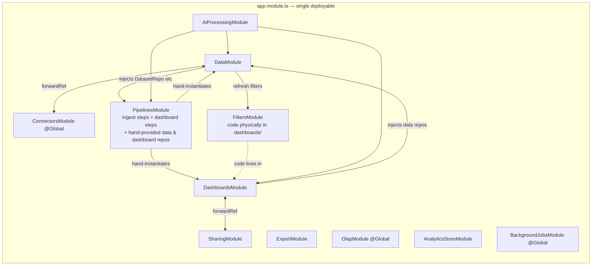
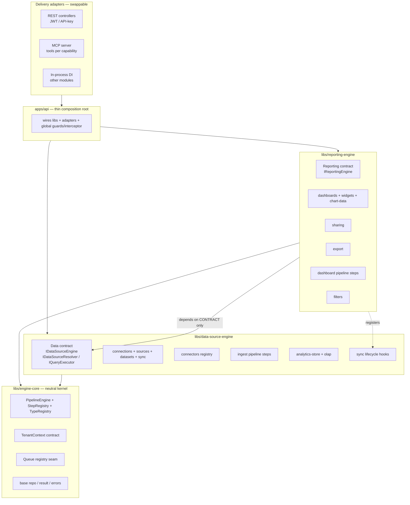

# Engine Isolation Architecture — Master Blueprint

> Target: two **self-contained, injectable, clean, extensible** engine domains — the **Data Source
> Engine** and the **Reporting Engine** — reusable anywhere in the system and exposable to other
> systems (REST API, MCP) via thin delivery adapters. This document is the durable blueprint for the
> whole program; individual phases are executed as their own `change-NNN` folders.

---

## 1. Guiding principles

1. **Contract-first.** Each engine exposes a small, stable **contract** (interfaces + DTOs + DI
   tokens). Callers depend on the contract, never on the engine's internals (repositories, schemas,
   processors).
2. **No cross-engine internal imports.** Reporting depends on the *Data Source contract*
   (`IDataSourceResolver` / `IQueryExecutor`) — not on `DatasetRepository`. Data never imports
   Dashboards (post-sync filter refresh becomes a lifecycle **hook**, not a direct call).
3. **Explicit tenant context.** A single `TenantContext` (`{ workspaceSlug, workspaceId, userId,
   role, engineId }`) is resolved once at the edge (JWT / API-key / MCP session) and injected —
   replacing manual `workspaceSlug` threading and enabling non-JWT callers.
4. **Delivery is an adapter.** Business logic lives in engines; how it's invoked (in-process DI, REST
   controller, MCP tool) is a swappable adapter. In-process today; REST + MCP later.
5. **Extensible by registration.** New connectors, OLAP engines, pipeline steps, pipeline types, and
   widget types are added by implementing an interface + one registry entry — the pattern already
   used for connectors/OLAP; we make it consistent and boundary-safe.
6. **Behavior-neutral refactor.** No user-facing behavior changes anywhere in the isolation program
   (until the deferred external-API/MCP change). Routes, DTOs, queues, and collections are preserved.

---

## 2. Current architecture (as-is)

Both capabilities are spread across many modules with circular deps and boundary leaks.

**Key problems (evidence in `impact.md`):** shared `PipelinesModule` monolith; `data → dashboards`
dependency via filters; two circular `forwardRef` pairs; `@Global()` hiding the graph; no tenant
context; no external surface.

---

## 3. Target architecture (to-be)

A NestJS **monorepo**: three libraries + a thin composition app. Delivery adapters wrap each engine.

**Dependency rule:** arrows point *down/inward*. `reporting-engine` may depend on the
`data-source-engine` **contract** and on `engine-core`; `data-source-engine` depends only on
`engine-core`; `engine-core` depends on nothing feature-specific. No upward or sideways-internal
imports.

---

## 4. Library boundaries & ownership

### `libs/engine-core` (neutral kernel — Phase 1)
- **Owns:** `PipelineEngine`, `StepRegistry`, `PipelineTypeRegistry`, `PipelineContext` /
  `PipelineStepInterface` / `SetupFlow`, `TenantContext` contract, queue-registry seam, shared result/
  error primitives.
- **Knows nothing about:** datasets, dashboards, connectors, OLAP.
- **Persistence:** engine-core stays persistence-agnostic; `PipelineRun` persistence is provided by
  the composing app/engine via an interface (workspace-scoped `ws_{slug}_pipeline_runs`).

### `libs/data-source-engine` (Phase 2)
- **Owns:** Connection / DataSource / Dataset / SyncRun / CsvFile (schemas, repos, services),
  `SyncService` + sync processor, `ConnectorRegistry` + connectors, `AnalyticsStoreService` + OLAP
  engines, ingest pipeline steps (extract → identify-columns → apply-mapping → transform → load),
  schema discovery + drift, setup-flow resolution.
- **Contract (public):**
  - `IDataSourceEngine` — connection/source/dataset CRUD, `triggerSync`, `getSetupFlow`,
    `listEntities`, `discoverSchema`.
  - `IDataSourceResolver` — read-only dataset metadata by id (schema, `analyticsTable`, semanticFlag,
    readiness) for reporting.
  - `IQueryExecutor` — run a dialect-neutral `QuerySpec` against a dataset's analytics table (wraps
    `AnalyticsStoreService`).
- **Extension points:** `ConnectorInterface` (+ registry), `OlapEngine` (+ registry), ingest step
  registration, **sync lifecycle hooks** (`onSyncComplete` / `onSyncFailed`) so post-sync concerns
  (filters refresh, notifications, usage metering) are injected, not hardwired.

### `libs/reporting-engine` (Phase 3)
- **Owns:** Dashboard / ChartWidget / DashboardDatasource / ChartDataCache / WidgetDefinition
  (schemas, repos, services), dashboard generation + widget CRUD pipeline steps, generation worker,
  sharing, export, and **filters** (moved to its real home).
- **Contract (public):** `IReportingEngine` — create/list/view dashboards, generate, widget CRUD,
  chart-data (cache-first), share-link resolution, export.
- **Depends on:** `IDataSourceResolver` + `IQueryExecutor` from the data-source-engine contract
  (never its repositories) + `engine-core`.
- **Registers:** the data-source-engine's `onSyncComplete` hook to refresh filter values (removes the
  `data → dashboards` dependency).
- **Extension points:** widget-type catalog, dashboard pipeline types/steps, export formats.

### `apps/api` (Phase 4)
- Thin composition root: imports the two engine libs, registers delivery adapters, applies global
  guards/interceptor/prefix, wires queues/Redis/Mongo, resolves `TenantContext` from JWT.

---

## 5. Cross-cutting seams introduced

| Seam | Purpose | Replaces |
|------|---------|----------|
| `TenantContext` (`@roya/engine-core`) | one resolved `{ workspaceSlug, workspaceId, userId, role, engineId }` injected per request/job | manual `workspaceSlug` params + JWT-embedded slug |
| Sync **lifecycle hooks** | `onSyncComplete/onSyncFailed` handlers registered by consumers | filters/notifications/metering hardwired in `DataSyncProcessor` |
| Engine **contract tokens** | `IDataSourceEngine`, `IDataSourceResolver`, `IQueryExecutor`, `IReportingEngine` | direct repo injection across features |
| Queue **registry** seam | typed queue names + producer/consumer registration | loose string constants spread across modules |
| Delivery **adapters** | in-process / REST / MCP over the same contract | JWT-only controllers baked into modules |

Cross-cutting concerns kept **out** of the engines and applied by the app/adapters where possible:
auth guards, response envelope, throttling, audit logging (via existing `@Global` audit service),
subscription metering (injected as a hook/policy), email verification gate.

---

## 6. Phase plan (each = its own change folder)

| Phase | Change | Deliverable | Risk | Behavior change |
|:-----:|--------|-------------|:----:|:---------------:|
| **1** | **change-060 (this)** | Neutral kernel extracted to isolated library `src/engine-core/` (`PipelineEngine`, registries, `PipelineContext`, `TenantContext`, queue-registry seam, `PIPELINE_RUN_STORE` seam); repoint pipeline imports. **In-`src` placement** (relative imports) to keep build/Docker unchanged. | M | none |
| **2** | **change-061 ✅** | `data-source-engine` decoupling: **2a** — break connectors↔data cycle (neutral connector SPI in `integrations/connectors/contract/`, retype interface + all 7 connectors, invert OAuth refresh, relocate `StreamingSyncCoordinator`→`modules/pipelines/streaming/` + `*DatasetService`→`modules/data/services/ecommerce/`, de-globalize `ConnectorsModule`); **2b** — neutral `SyncLifecycleRegistry` seam in engine-core + `FilterRefreshSyncHook` (filters), removing `data → dashboards` from `DataSyncProcessor`. `IDataSourceEngine`/`IDataSourceResolver`/`IQueryExecutor` + full `TenantContext` adoption deferred (Phase 3/4). | H | none |
| **3** | **change-062 ✅** | `reporting-engine` decoupling: **3a** — break dashboards↔sharing cycle via IoC (consumer-owned `ShareTokenResolver` port + registry in dashboards; `SharingService` self-registers; both `forwardRef`s removed → one-way `sharing → dashboards`); **3b** — reporting reads data via a read-only `IDataSourceResolver` contract (`DATA_SOURCE_RESOLVER`) instead of `DatasetRepository`/`CsvFileRepository` (zero `modules/data/repositories\|schemas` imports in dashboards; queries stay on shared `AnalyticsStoreService`; filter-refresh sync hook already landed in change-061/2b). `IReportingEngine` public contract + physical `libs/` move + pipeline-step/filters relocation deferred (Phase 4/5). | H | none |
| **4** | **change-063 ✅ (re-scoped)** | **Boundary lock-in** instead of the physical move. Recon: `nest build`=`tsc` (no alias rewrite), `module: nodenext`, no `paths`, Dockerfile copies only `src/` → `dist/main.js`; a naive `libs/`+`@roya/*` move breaks runtime/Docker for organizational-only benefit. Instead added `no-restricted-imports` ESLint guardrails encoding the 060–062 boundaries (zero infra risk). **Physical monorepo move deferred** (optional; when done, use `tsc` + `paths` + `tsconfig-paths/register` — lighter than a webpack monorepo). | L | none |
| 5 (deferred) | change-064+ | Delivery adapters: REST M2M API (API-key/service-JWT + `TenantContext` from key) with versioned public endpoints + OpenAPI; **MCP server** exposing both engine contracts as tools. | H | additive |

**Sequencing rationale:** extract the neutral kernel first (Phase 1) so both engines can rebuild on a
stable base; isolate the *producer* (data) before the *consumer* (reporting); do the physical `libs/`
+ monorepo/Docker move last (Phase 4), once boundaries are proven, to keep each earlier step low-risk
and CI-green; add external delivery only after that.

> **Why the `libs/` move is Phase 4, not Phase 1:** `Dockerfile.build` copies only `src/`, the build
> must emit `dist/main.js`, and the repo uses relative imports (no path aliases). Moving to `libs/` +
> `@roya/*` now would break CI and force Docker/build changes — so Phase 1 keeps the kernel at
> `src/engine-core/` with the same isolated boundary and contracts, and the packaging move is batched
> into Phase 4 where the build/Docker changes belong.

---

## 7. Phase 1 detail (this change) — implemented

**Goal:** relocate the neutral pipeline/engine kernel into an isolated library with zero behavior
change, without touching build/Docker.

- **`src/engine-core/`** (new isolated library): `pipeline.interface.ts` (generic, neutral),
  `step.registry.ts`, `pipeline-type.registry.ts`, `pipeline.engine.ts` (genericized), `tenant-context.ts`
  (contract + token), `queue-registry.ts` (seam), `pipeline-run-store.ts` (`PIPELINE_RUN_STORE` seam +
  interface), `engine-core.module.ts`, `index.ts` barrel.
- **Neutrality achieved:** the engine no longer imports data schemas. `PipelineContext<TDataset,
  TConnection>` is generic; `mode` is a neutral `string`; the engine reads dataset id/staging table
  via a structural `PipelineTargetLike` (or explicit `datasetId`/`stagingTable` options), and persists
  runs through the injected `PIPELINE_RUN_STORE` instead of importing the repo.
- **Kept in `modules/pipelines` (step-pack, moves in phases 2–3):** all step implementations,
  `PipelineRunRepository` (bound to `PIPELINE_RUN_STORE`), `ColumnIdentifyService`. Two thin shims
  (`step.registry.ts`, `pipeline.interface.ts`) re-export the kernel and specialize the context with
  domain types so the ~20 step files stayed untouched.
- **Repointed imports:** `data-sync.processor`, `dataset.service`, `dashboard-generation.processor`,
  `dashboards.service`, and `pipelines.module` now import the kernel from `src/engine-core`.
- **Verified:** `nest build` clean; `dist/main.js` + AI/prompt/widget-catalog assets emitted; app
  boots; all 4 pipeline types (ingest/dashboard-generate/add-widget/edit-widget) + 20 steps register
  identically; `Nest application successfully started`.

**Explicitly deferred:** physical `libs/` + `@roya/*` alias + monorepo/Docker wiring (→ Phase 4),
moving steps/repos into engine boundaries (→ phases 2–3), `TenantContext` adoption (contract only
now), lifecycle hooks, data/reporting contract interfaces, and all delivery adapters.

---

## 8. Extensibility outcomes (why this matters)

Once complete, adding capability is local and boundary-safe:
- **New data source** → implement `ConnectorInterface` + register (already true; boundary enforced).
- **New OLAP backend** → implement `OlapEngine` + register.
- **New ingest/dashboard step or pipeline type** → implement interface + register in the owning engine.
- **New widget type** → catalog + step, within reporting-engine only.
- **New caller (another app / service / AI agent)** → consume `IDataSourceEngine` / `IReportingEngine`
  in-process, or over REST/MCP via an adapter — with `TenantContext` supplied by the adapter's auth.

---

## 9. Open items / deferred

- **Plan-vs-code drift (noted, not fixed here):** `modules/templates` + `dashboard-from-template`
  pipeline steps (change-049) are documented but absent in code; `pdf-export` /
  `cache-recalculation` queues have no workers. Revisit when the reporting-engine is isolated.
- **External auth model** (API keys vs service JWTs) and **MCP tool surface** are designed for in this
  blueprint but specified in the deferred Phase 5 change.
