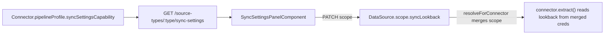

# Impact Analysis — Google Ads Connection Type

## Code Reconnaissance

| Layer | State | Location | Gaps |
|-------|:-----:|----------|------|
| Google Ads connector | **none** | — | Greenfield |
| Sync settings framework | **none** | — | No connector-declared lookback; no UI |
| OAuth (Google Ads) | **none** | `integrations/oauth/google/` is Sheets-only scopes | Need separate `google-ads-oauth.service.ts` + env |
| Entity selection | **complete** | `entity-select-step`, `dataset.service listDataSourceEntities` | Reuse as-is |
| DataSource scope update | **complete** | `PATCH /data/sources/:id`, `UpdateDataSourceDto.scope` | Reuse; add sync lookback in scope |
| Connector registry | **complete** | `connector.registry.ts`, `onModuleInit` pattern | One `register()` line |
| Pipeline profile | **complete** | `SourcePipelineProfile` in `engine-core/pipeline.interface.ts` | Extend with optional `syncSettingsCapability` |
| MCC / customer picker | **none** | Google Sheets has spreadsheet picker in connect component | New pattern: list customers post-OAuth |
| marketing_spend canonical | **none** in code | `canonical-fields.config.ts` | Planned in change-049 but not implemented |
| Source detail settings | **partial** | `source-detail.page` — rename, test, sync tables | No generic sync settings panel |

**Feature state:** none (greenfield connector + new cross-cutting sync-settings capability)

**Plan-vs-code drift:** `marketing_spend` in `modules.md` / change-049 docs but missing from `canonical-fields.config.ts` — **complete in place** as part of this change.

## Google Ads Entity Catalog (v1)

Each entity = one Dataset via `sourceRef`. Performance entities use `segments.date` for incremental sync and respect `syncLookback`.

### Preselected (core)
| Entity key | Label | Semantic flag | GAQL FROM resource |
|------------|-------|---------------|-------------------|
| `campaign_performance` | Campaign Performance (Daily) | `marketing_spend` | `campaign` + metrics + `segments.date` |
| `campaigns` | Campaigns | `arbitrary` | `campaign` |
| `ad_groups` | Ad Groups | `arbitrary` | `ad_group` |
| `ads` | Ads | `arbitrary` | `ad_group_ad` |

### Opt-in — Performance (marketing_spend)
| Entity key | Label | GAQL FROM |
|------------|-------|-----------|
| `ad_group_performance` | Ad Group Performance (Daily) | `ad_group` |
| `ad_performance` | Ad Performance (Daily) | `ad_group_ad` |
| `keyword_performance` | Keyword Performance (Daily) | `keyword_view` |
| `search_term_performance` | Search Term Performance (Daily) | `search_term_view` |
| `audience_performance` | Audience Performance (Daily) | `ad_group_audience_view` |
| `geo_performance` | Geographic Performance (Daily) | `geographic_view` |
| `device_performance` | Device Performance (Daily) | `campaign` + `segments.device` |

### Opt-in — Structure
| Entity key | Label | GAQL FROM |
|------------|-------|-----------|
| `keywords` | Keywords | `ad_group_criterion` (type=KEYWORD) |
| `audiences` | Audiences | `audience` |
| `conversion_actions` | Conversion Actions | `conversion_action` |
| `campaign_budgets` | Campaign Budgets | `campaign_budget` |
| `labels` | Labels | `label` |

### Opt-in — Billing
| Entity key | Label | GAQL FROM |
|------------|-------|-----------|
| `account_budgets` | Account Budgets | `account_budget` |
| `billing_setup` | Billing Setup | `billing_setup` |

**Total: 18 entities** — user selects in wizard; 4 preselected.

## Affected Modules

### Backend — Create
| File | Purpose |
|------|---------|
| `integrations/connectors/google-ads/google-ads.connector.ts` | ConnectorInterface + `GOOGLE_ADS_ENTITIES` + GAQL templates |
| `integrations/connectors/google-ads/google-ads-api.client.ts` | SearchStream, listAccessibleCustomers, token refresh |
| `integrations/connectors/google-ads/google-ads-oauth.service.ts` | Dedicated OAuth (`adwords` scope, offline) |
| `integrations/connectors/google-ads/google-ads-rate-limiter.ts` | API quota protection |
| `modules/data/controllers/google-ads.controller.ts` | auth-url, callback, list-customers |
| `modules/data/services/google-ads-dataset.service.ts` | connectFromOAuth, customer scope |
| `integrations/connectors/contract/sync-settings-capability.ts` | Neutral SPI type for lookback presets |

### Backend — Modify
| File | Change |
|------|--------|
| `connectors.module.ts` | Register Google Ads providers |
| `data.module.ts` | Register controller + service |
| `data-connection.schema.ts` | Add `'google_ads'` to `DataSourceType` |
| `datasource-type-meta.schema.ts` + seed | UI metadata |
| `config.ts` + `env.validation.ts` | `GOOGLE_ADS_*` env vars |
| `canonical-fields.config.ts` | Add `marketing_spend` canonical model + synonyms |
| `engine-core/pipeline.interface.ts` | Add optional `syncSettingsCapability` to `SourcePipelineProfile` |
| `connector.interface.ts` | Re-export sync settings type |
| `data-source-pipeline.service.ts` | Expose sync-settings in setup-flow or new metadata method |
| `datasets.controller.ts` | `GET /data/source-types/:type/sync-settings` endpoint |

### Frontend — Create
| File | Purpose |
|------|---------|
| `setup/connect/google-ads-connect.component.ts` | OAuth + customer/MCC picker |
| `shared/components/sync-settings-panel/` | Generic lookback preset UI (connector-driven) |

### Frontend — Modify
| File | Change |
|------|--------|
| `source-connect.registry.ts` | Register `google_ads` |
| `data.models.ts` | Add type + `SyncSettingsCapability` model |
| `data.service.ts` | Google Ads + sync-settings API methods |
| `source-detail.page.ts/html` | Sync Settings section (when capability supported) |
| `connections.page.ts` | Add to `isOauthType()` |

### Plan docs — Update (Step 5.3)
| Doc | Change |
|-----|--------|
| `project/plan/modules.md` | Data module: add `google_ads` type; sync settings feature note |
| `project/plan/data-model.md` | `DataSource.scope.syncLookback`; `marketing_spend` fields |
| `project/actions/backend/endpoints.md` | Google Ads + sync-settings endpoints |
| `project/actions/backend/services.md` | Google Ads services |
| `project/actions/customer-portal/pages.md` | Connect wizard + source detail sync settings |
| `project/profile.md` | Google Ads integration row |
| `project/rules.md` | Google Ads env + read-only rule |
| `project/description.md` | Feature bullet under Data |
| `project/docs/data-sources/google-ads.md` | New developer/merchant doc |
| `project/docs/data-sources/README.md` | Index entry |

## Sync Settings Framework Design

**Presets (Google Ads v1):** `7d`, `30d`, `90d`, `180d`, `365d`, `all` (default `90d`).

**Extensibility:** Zid/Salla can later add `syncSettingsCapability` with different presets (e.g. order lookback) without UI rework.

## Ripple / Safety Analysis

| Area | Action | Risk |
|------|--------|------|
| `engine-core` / `PipelineEngine` | **No change** | Low |
| Existing 7 connectors | **No change** (optional type extension only) | Low |
| `SourcePipelineProfile` | **Add optional field** — backward compatible | Low |
| Google Sheets OAuth | **Untouched** — separate client | Low |
| Entity selection pipeline | **Reuse** | Low |
| Ingest pipeline steps | **Reuse** via `pipelineProfile` | Low |
| ESLint boundary rules (change-063) | New connector under `integrations/connectors/` only | Low |

## Risk Assessment
- **Complexity:** High (new external API + OAuth + MCC + 18 entities + new cross-cutting settings)
- **Cross-module:** Yes (connectors, data, frontend, engine-core type extension)
- **Migration:** No — new source type only; `syncLookback` optional on scope

## Recommendation

### Create
- Full Google Ads connector stack (connector, API client, OAuth, controller, dataset service)
- `SyncSettingsCapability` contract + metadata endpoint + frontend panel
- `google-ads-connect.component.ts`
- `project/docs/data-sources/google-ads.md`
- `marketing_spend` in canonical-fields

### Complete
- `marketing_spend` canonical model (planned, not in code)
- Source detail page (add settings section)

### Modify (ripple)
- `SourcePipelineProfile` — optional `syncSettingsCapability`
- `datasets.controller.ts` — sync-settings metadata route
- Planning docs (scoped list above)

### Do NOT
- Edit kernel pipeline registration logic
- Share OAuth client with Google Sheets
- Auto-create datasets at OAuth time (user must select entities)
