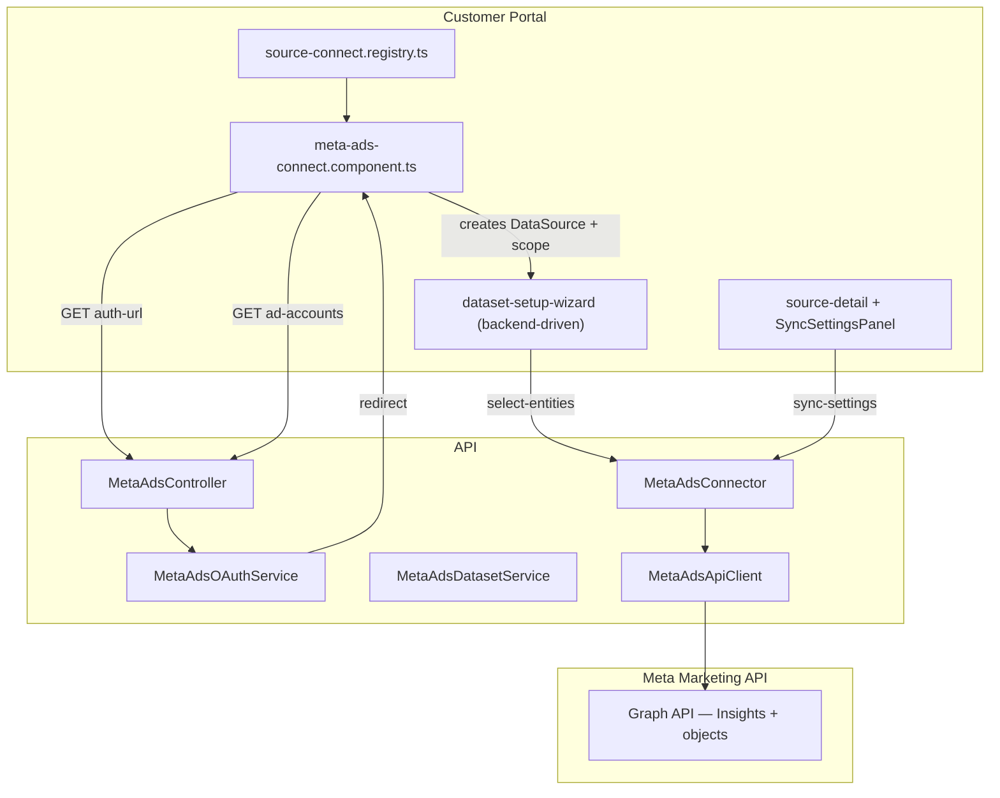

# Impact Analysis — Meta Ads Connection Type

## Flow Classification

**Standard Flow** (not Fast-Track):
- Touches Data module + Connectors + customer-portal
- New OAuth endpoints + ad-account listing
- Both backend and frontend
- New connector stack (greenfield)

## Code Reconnaissance

| Layer | State | Location | Action |
|-------|:-----:|----------|--------|
| Meta Ads connector | **none** | — | **Create** (mirror `google-ads/`) |
| OAuth (Meta Ads) | **none** | Social login OAuth is user-auth only | **Create** dedicated `meta-ads-oauth.service.ts` |
| Entity selection | **complete** | `entity-select-step`, `listDataSourceEntities` | **Reuse** |
| Sync settings framework | **complete** | change-067 `SourcePipelineProfile.syncSettings` | **Reuse** — no framework changes |
| Ad account picker | **none** | Google Ads has customer picker | **Create** `meta-ads-connect.component.ts` |
| Connection OAuth reuse | **complete** | `connections.page.ts`, re-auth via connect route | **Extend** `isOauthType()` |
| `datasource_type_meta` seed | **complete** | `datasource-type-meta.seed.ts` | **Add** `meta_ads` row |
| `marketing_spend` canonical | **complete** | change-067 `canonical-fields.config.ts` | **Reuse** — map Meta insights columns |

**Feature state:** none (greenfield connector)

**Reference patterns:**
- **Google Ads** — advertising OAuth, account picker, entity catalog, insights sync, sync lookback
- **Zid** — OAuth callback → `connectFromOAuth` → connection record only (no auto-datasets)

---

## Architecture



---

## Meta Ads Entity Catalog (v1 proposal)

Each entity = one Dataset via `sourceRef`. Performance entities use `date_start`/`date_stop` daily breakdown and respect `syncLookback`.

### Preselected (core)
| Entity key | Label | Semantic flag | API source |
|------------|-------|---------------|------------|
| `campaign_insights` | Campaign Performance (Daily) | `marketing_spend` | `act_{id}/insights` level=campaign, time_increment=1 |
| `campaigns` | Campaigns | `arbitrary` | `act_{id}/campaigns` |
| `adsets` | Ad Sets | `arbitrary` | `act_{id}/adsets` |
| `ads` | Ads | `arbitrary` | `act_{id}/ads` |

### Opt-in — Performance (`marketing_spend`)
| Entity key | Label | API source |
|------------|-------|------------|
| `adset_insights` | Ad Set Performance (Daily) | insights level=adset |
| `ad_insights` | Ad Performance (Daily) | insights level=ad |
| `platform_insights` | Platform Breakdown (Daily) | insights + `publisher_platform` breakdown |
| `device_insights` | Device Breakdown (Daily) | insights + `device_platform` breakdown |
| `age_gender_insights` | Age & Gender (Daily) | insights + `age,gender` breakdown |
| `region_insights` | Region Performance (Daily) | insights + `region` breakdown |

### Opt-in — Structure & targeting
| Entity key | Label | API source |
|------------|-------|------------|
| `ad_creatives` | Ad Creatives | `act_{id}/adcreatives` |
| `custom_audiences` | Custom Audiences | `act_{id}/customaudiences` |
| `saved_audiences` | Saved Audiences | `act_{id}/saved_audiences` |

**Total: 14 entities** — 4 preselected. Count can be trimmed at implementation time if Meta field parity differs.

### Core insights fields (campaign_insights → marketing_spend)
| Meta field | Canonical / column | Notes |
|------------|-------------------|-------|
| `date_start` | date | daily grain |
| `campaign_id` | campaign_id | |
| `campaign_name` | campaign_name | |
| `impressions` | impressions | |
| `clicks` | clicks | |
| `spend` | spend | Meta returns currency units (not micros) |
| `actions` (purchase/conversion) | conversions | parse action_type |
| `account_currency` | currency | from account metadata |

---

## File Plan

### Backend — Create
| File | Purpose |
|------|---------|
| `integrations/connectors/meta-ads/meta-ads.connector.ts` | `ConnectorInterface` + entity defs + extract/discover |
| `integrations/connectors/meta-ads/meta-ads.entities.ts` | Entity catalog, lookback presets, Insights field maps |
| `integrations/connectors/meta-ads/meta-ads-api.client.ts` | Graph API: insights pagination, list ad accounts, token refresh |
| `integrations/connectors/meta-ads/meta-ads-oauth.service.ts` | OAuth + Redis CSRF nonce + long-lived token exchange |
| `modules/data/controllers/meta-ads.controller.ts` | `auth-url`, `callback`, `ad-accounts` |
| `modules/data/services/meta-ads-dataset.service.ts` | `connectFromOAuth` → DataConnection only |

### Backend — Modify
| File | Change |
|------|--------|
| `connectors.module.ts` | Register Meta Ads providers + exports |
| `data.module.ts` | Register controller + dataset service |
| `datasource-type-meta.schema.ts` | Add `'meta_ads'` to enum |
| `database/seeds/datasource-type-meta.seed.ts` | Add seed row |
| `config.ts` | `metaAds.*` config block |
| `env.validation.ts` | `META_ADS_*` optional env vars |
| `package.json` | Optional: no new dep if using `fetch` / existing HTTP client |

### Frontend — Create
| File | Purpose |
|------|---------|
| `setup/connect/meta-ads-connect.component.ts` | OAuth button + ad account (and optional Business) picker |

### Frontend — Modify
| File | Change |
|------|--------|
| `source-connect.registry.ts` | Register `meta_ads` (category: `advertising`) |
| `data.models.ts` | Add `'meta_ads'` to `DataSourceType` |
| `data.service.ts` | `getMetaAdsAuthUrl`, `listMetaAdsAdAccounts` |
| `connections.page.ts` | Add to `isOauthType()` |
| `public/i18n/en.json` + `ar.json` | OAuth hints if needed (optional — inline EN in component like Google Ads v1) |

### Plan docs — Update (Step 5.3)
| Doc | Change |
|-----|--------|
| `project/plan/modules.md` | Add `meta_ads` to connection types list |
| `project/plan/data-model.md` | Document `DataSource.scope.adAccountId` / `businessId` for meta_ads |
| `project/actions/backend/endpoints.md` | Meta Ads routes |
| `project/actions/backend/services.md` | Meta Ads services |
| `project/actions/customer-portal/pages.md` | Connect wizard entry |
| `project/profile.md` | Meta Marketing API integration row |
| `project/rules.md` | Meta Ads env + read-only rule |
| `project/description.md` | Feature bullet under Data |
| `project/docs/data-sources/meta-ads.md` | New developer/merchant doc |
| `project/docs/data-sources/README.md` | Index entry |

---

## API Endpoints (new)

| Method | Path | Auth | Purpose |
|--------|------|------|---------|
| GET | `/data/meta-ads/auth-url` | JWT | OAuth consent URL |
| GET | `/data/meta-ads/callback` | Public | OAuth callback; creates/updates connection |
| GET | `/data/meta-ads/businesses` | JWT | List accessible Business Managers (required picker) |
| GET | `/data/meta-ads/ad-accounts` | JWT | List ad accounts for `businessId` (required query param) |

Reuse existing:
- `GET /data/source-types/meta_ads/sync-settings`
- Standard wizard: setup-flow, select-entities, schema-review, schedule, sync

---

## Environment Variables

| Variable | Required | Notes |
|----------|----------|-------|
| `META_ADS_APP_ID` | Yes | Meta app ID |
| `META_ADS_APP_SECRET` | Yes | App secret |
| `META_ADS_CALLBACK_URL` | Yes | Must match Meta app redirect URI |
| `META_ADS_API_VERSION` | No | Default `v21.0` (or latest stable) |
| `CREDENTIALS_ENCRYPTION_KEY` | Yes | Existing |
| `FRONTEND_URL` | Yes | Post-OAuth redirects |
| `REDIS_*` | Yes | OAuth CSRF nonce |

Redirect URI pattern (match Google Ads):
- Production: `https://dynamo-api.roya.marketing/api/v1/data/meta-ads/callback`
- Development: `https://dynamo-api-dev.roya.marketing/api/v1/data/meta-ads/callback`
- Local: `http://localhost:3000/api/v1/data/meta-ads/callback`

---

## Connector `pipelineProfile`

```typescript
{
  ingestOverrides: { 'apply-mapping': { enabled: false } },
  wizard: { entitySelection: true },
  syncSettings: {
    enabled: true,
    scopeField: 'syncLookback',
    presets: META_ADS_SYNC_LOOKBACK_PRESETS, // same ids as Google Ads
    defaultPresetId: '90d',
  },
}
```

Streaming sync: enable with page cursor (`after` from Graph API paging), similar page sizes to Google Ads.

---

## Seed Entry (`datasource-type-meta.seed.ts`)

```typescript
{
  sourceType: 'meta_ads',
  titleEn: 'Meta Ads',
  titleAr: 'إعلانات Meta',
  logoUrl: null,
  instructionEn:
    'Connect your Meta (Facebook & Instagram) ad account via OAuth. Pick the ad account, select report entities, and configure how far back to sync performance data.',
  instructionAr:
    'قم بربط حساب Meta (Facebook و Instagram) للإعلانات عبر OAuth. اختر حساب الإعلانات، وحدد كيانات التقارير، واضبط مدى استيراد بيانات الأداء.',
  isActive: true,
},
```

---

## Ripple / Safety Analysis

| Area | Action | Risk |
|------|--------|------|
| `engine-core` / `PipelineEngine` | **No change** | Low |
| Existing 8 connectors | **No change** | Low |
| Sync settings framework | **Reuse** — Meta declares capability | Low |
| Google Ads connector | **Untouched** | Low |
| Entity selection pipeline | **Reuse** | Low |
| ESLint boundary rules | New code under `integrations/connectors/` only | Low |
| Meta API approval | App review may be needed for production `ads_read` | **Medium** — document in setup guide |

---

## Implementation Order

1. **Backend connector layer** — entities, API client, OAuth, connector registration
2. **Backend data module** — controller, dataset service, env config
3. **Seed** — `meta_ads` in `datasource-type-meta.seed.ts`
4. **Frontend connect** — component + registry + data.service + connections OAuth list
5. **Plan docs** — in-place updates per table above
6. **Verify** — build, manual OAuth smoke test (dev Meta app), entity sync sample

---

## User Decisions (confirmed 2026-07-15)

| # | Decision |
|---|----------|
| 1 | **All 14 entities** in v1 |
| 2 | **Business Manager picker required** before ad account list |
| 3 | **Single `meta_ads` connection** for Facebook + Instagram ads (platform breakdown via `platform_insights`; no separate connection types) |
| 4 | **Greenfield Meta app** — full developer setup doc from scratch |

### Connect wizard UX (updated)

```
OAuth → Select Business Manager (required) → Select Ad Account (required) → Entity selection → …
```

- `GET /data/meta-ads/businesses` — list businesses user can access
- `GET /data/meta-ads/ad-accounts?businessId=…` — list ad accounts scoped to selected business
- If user has exactly one business, pre-select it but still show the picker (required step, not skippable)

---

## Recommendation

**Proceed with Standard Flow** using Google Ads as the primary template:
- Same wizard path (OAuth → account picker → entity selection → schema → schedule)
- Same sync-settings reuse
- Zid-like OAuth connection provisioning (connection only at callback; DataSource created in connect step with `adAccountId` in scope)

Estimated touch surface: ~12 new files, ~15 modified files, 1 seed row, 6 plan docs.
